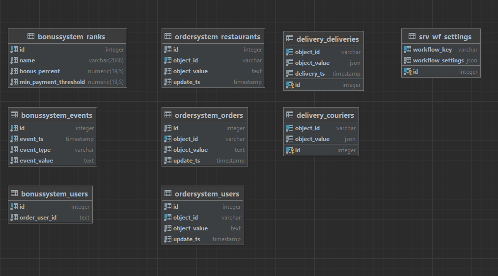
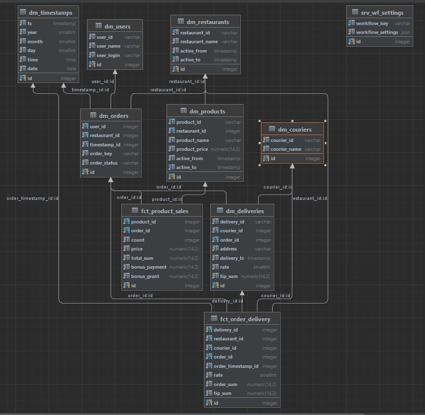
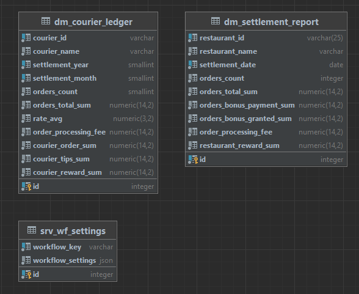

# Решение.

Репозиторий: https://github.com/abdurahim-dag/de-project-4

Источник: система курьерской службы.

### Структура репозитория
- `./src/dags/realization` даги и необходимы модули;
- Makefile основной управляющий файл контейнером;
- docker-compose.yml орбаз с решением.

## Порядок запуска

`make passPG=<pass> api-key=<api-key> start`
- passPG пароль пользователя к БД источника.
- api-key ключ авторизации к API

`make stop`

После того как запустится контейнер, вам будут доступны:
- Airflow
	- `localhost:3000/airflow`
- БД
	- `jovyan:jovyan@localhost:15432/de`

Airflow доступен по адресу http://localhost:3000/airflow
```
login: AirflowAdmin
password: airflow_pass
```

### Список полей и сущностей, которые необходимы для витрины доставки.

Для заполнения витрины нам необходимы, следующие сущности с полями:
 1. Курьер:
    - ID курьера в системе;
    - Имя курьера.
 2. Доставки:
    - ID доставки в системе;
    - ID заказа по, которому осуществлена доставка;
    - ID курьера;
    - сумма выплаченных чаевых;
    - время доставки;
    - рейтинг курьера.

 Сущность ресторана из API мы не используем, так как данные по ресторанам уже есть в системе.
 
### Описание логики загрузки в STG слой.

1. Выгрузка из источника данных по курьерам будет происходить по SCD0. Ни одно из полей в системе не даёт возможности выгружать данные с сохранением прогресса. Сортировка по полям _id или name не возможность использовать в качестве смещения.
2. В выгрузке доставок в качестве смещения будет использоваться и сохранятся параметр запроса к API `from`.

### Описание реализации загрузки в DDS слой.
В качестве способа переноса из STG слоя в DDS выбран шаблонный sql запрос на вставку. Так, же сохраняется курсоры на последние обработанные записи в STG слое.

### Описание реализации загрузки в CDM слой.
В качестве способа переноса из DDS слоя в CDM, также выбран шаблонный sql запрос на вставку. Сохраняется курсор прогресса последних обработанных записей в DDS слое.

### Итоговая ER диаграмма STG слоя.



### Итоговая ER диаграмма DDS слоя.



### Итоговая ER диаграмма CDM слоя.



